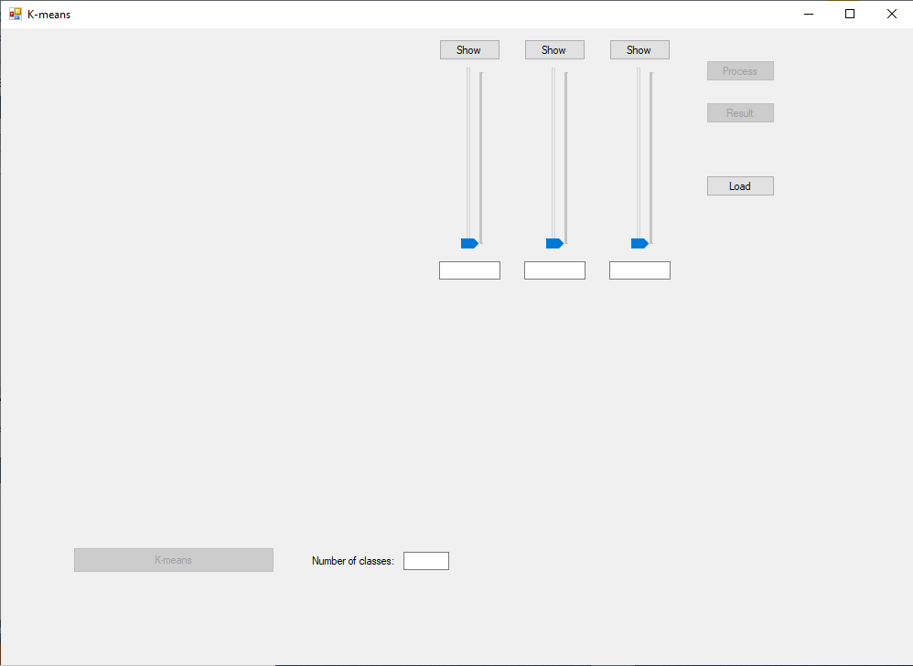
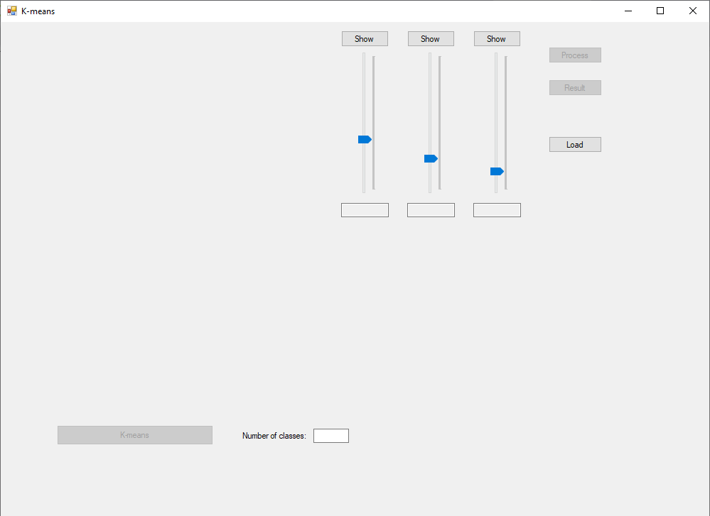
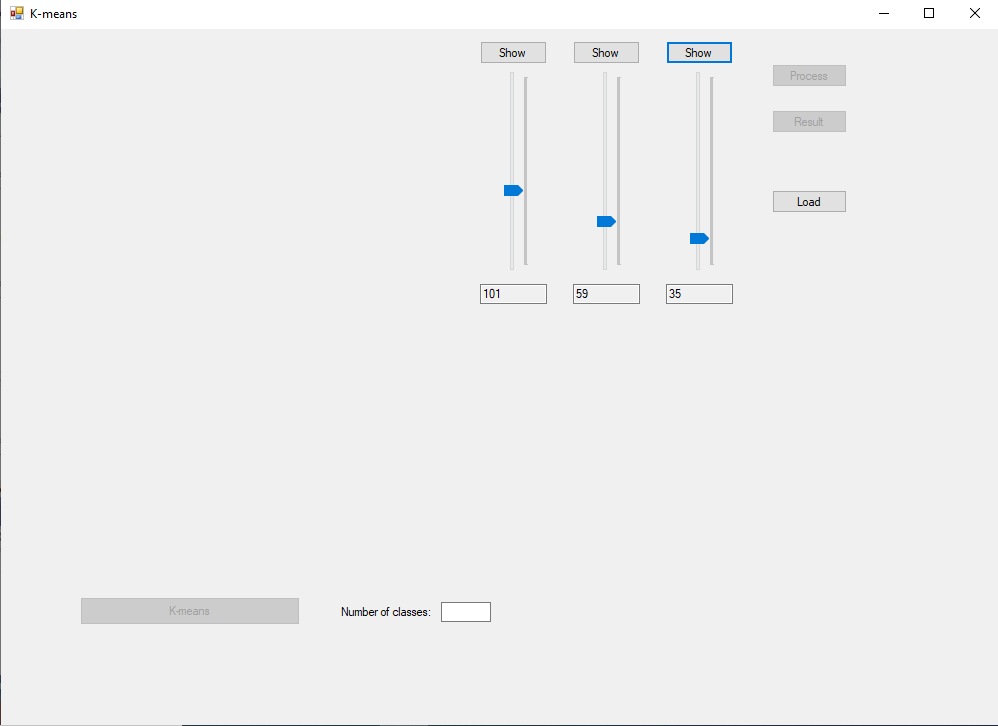
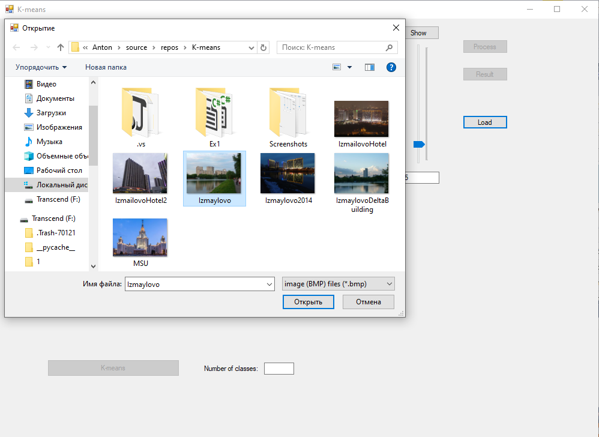
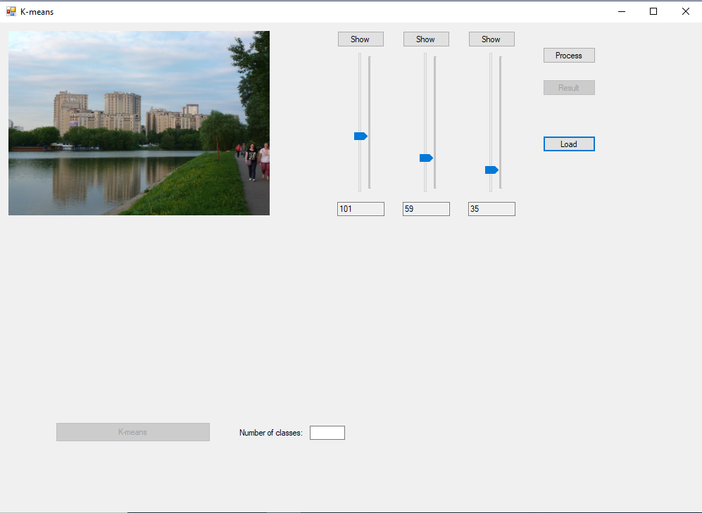
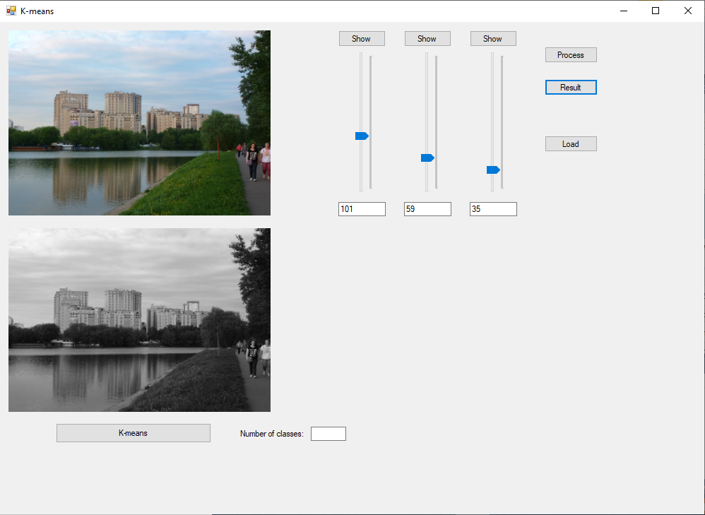
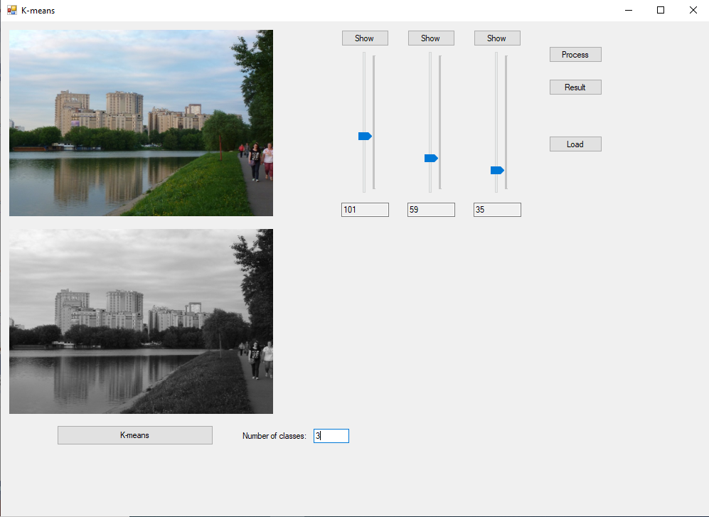
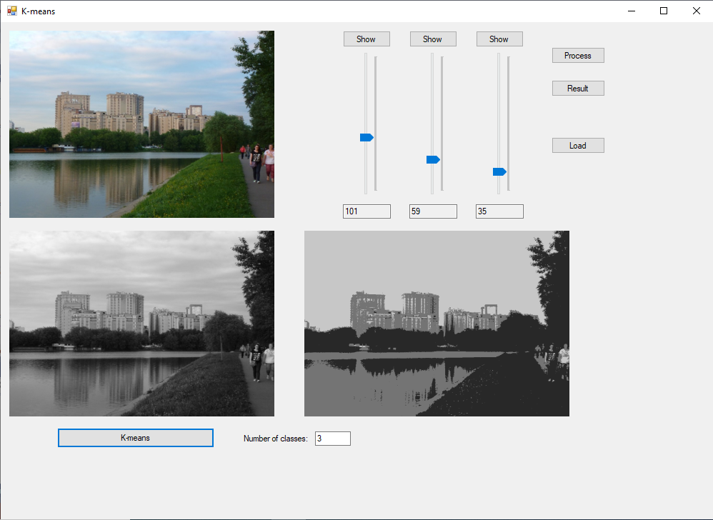

# K-means

K-means - an algorithm for image processing implemented on C#/.NET (Desktop Application)

K-means is an algorithm which is used in computer vision.

This program is written using .NET Framework.

<h3>Here are examples of how this application works:</h3>

<strong>So here is the final result:</strong>

